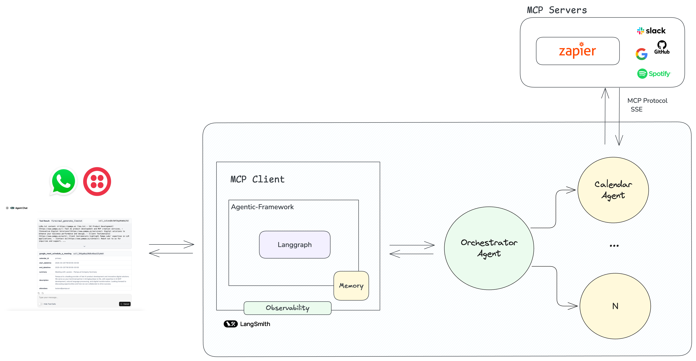
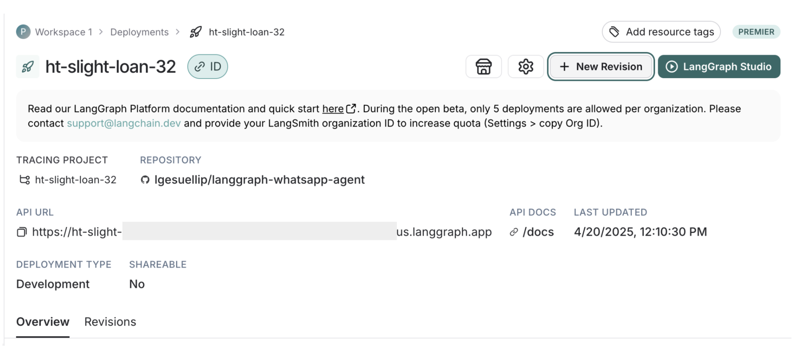
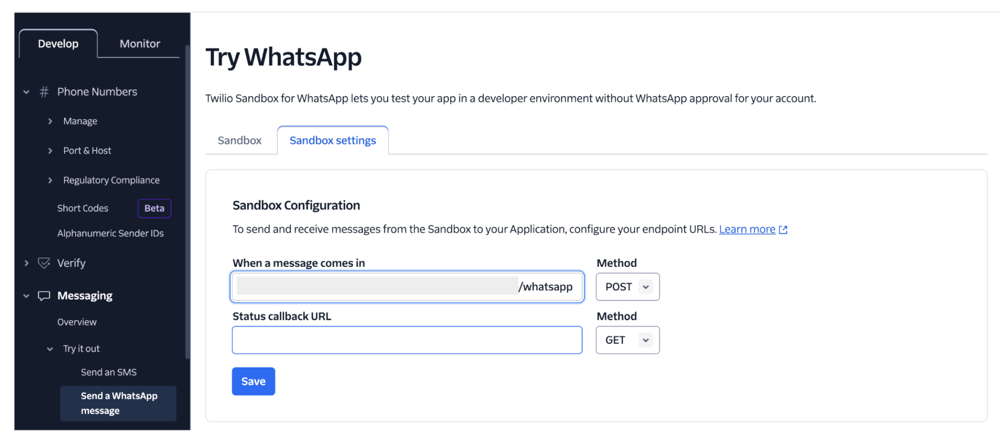

# LangGraph WhatsApp Agent

A template for building WhatsApp agents using LangGraph and Twilio. This project enables you to deploy AI agents that interact with users via WhatsApp, process messages and images, and invoke custom graph-based agents hosted on the LangGraph Platform.

It provides a foundation for building scalable, secure, and maintainable AI agent services.

Fork this repo and iterate to create your production-ready solution.



## Features

- Create custom LangGraph-powered agents for WhatsApp
- Support for multi-agents with supervisor-based architecture
- Integration with Model Context Protocol (MCP) servers (Supermemory, Sapier, etc.)
- Support for image processing and multimodal interactions
- Persistent conversation state across messages
- Request validation for security
- Comprehensive observability via LangSmith
- Easy deployment with LangGraph Platform

## Stack

- **WhatsApp Integration**: Twilio API for messaging and multimedia handling
- **Agent Framework**: LangGraph (by LangChain) as the MCP client and multi-agent system using langgraph_supervisor
- **Models**: Supports Google Gemini, OpenAI GPT models, and more
- **MCP Servers**:
  Using langchain-mcp-adapters
  - Supermemory
  - Zapier for access to thousands of apps and integrations (Google, Slack, Spotify, etc.)
- **Observability**: Complete tracing with LangSmith
- **Deployment**: LangGraph Platform for simplified production hosting

## Prerequisites

- Twilio account with WhatsApp integration
- API key for LLM access (OpenAI, Google, etc.)
- LangGraph Platform access
- (Optional) MCP server configurations

## Setup Instructions

### 1. Environment Configuration

1. Copy the environment template:
   ```bash
   cp .env.example .env
   ```

2. Fill in the required environment variables in `.env`:

   **Required Variables:**
   - `GOOGLE_API_KEY`: Get from [Google AI Studio](https://aistudio.google.com/)
   - `TWILIO_AUTH_TOKEN` & `TWILIO_ACCOUNT_SID`: From your [Twilio Console](https://console.twilio.com/)
   - `LANGGRAPH_URL`: Your LangGraph Platform deployment URL
   - `LANGGRAPH_ASSISTANT_ID`: Assistant ID from LangGraph Platform (defaults to "agent")

   **Optional Variables:**
   - `ZAPIER_URL_MCP` & `SUPERMEMORY_URL_MCP`: MCP server URLs if using external tools
   - `LANGSMITH_API_KEY`: For observability via [LangSmith](https://smith.langchain.com/)

### 2. Install Dependencies

Using uv (recommended):
```bash
uv install
```

Or using pip:
```bash
pip install -e .
```

### 3. Local Development

Test the server locally:
```bash
uvicorn src.langgraph_whatsapp.server:APP --host 0.0.0.0 --port 8081 --reload
```

### 4. Deploy to LangGraph Platform

1. Configure your `langgraph.json` deployment settings
2. Deploy using the LangGraph CLI:
   ```bash
   langgraph deploy
   ```
3. Note your deployment URL for Twilio webhook configuration



### 5. Configure Twilio Webhook

1. Go to your Twilio Console > WhatsApp > Sandbox settings
2. Set the webhook URL to: `https://your-deployment-url.com/whatsapp`
3. Set the HTTP method to `POST`



## Customization

### Adding New Agents

1. Create a new agent in `src/agents/`
2. Update `src/agents/base/graph.py` to include your agent
3. Modify prompts in `src/agents/base/prompt.py`

### Adding MCP Servers

1. Add your MCP server URL to the environment variables
2. Update the server configuration in `src/agents/base/graph.py`

### Modifying Agent Behavior

- Edit prompts in `src/agents/base/prompt.py`
- Update agent logic in `src/agents/base/graph.py`
- Customize the supervisor prompt for different orchestration strategies

## Getting Started

1. Fork this repository to start your own project
2. Follow the setup instructions above
3. Customize the agents for your use case
4. Deploy to LangGraph Platform
5. Configure Twilio webhook to point to your deployment

## License

This project is licensed under the terms included in the LICENSE file.